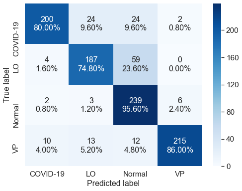

# CSIC 5011 / MATH 5473 Final Project  Imaging’s Potential to Assist in COVID-19 Crisis
> Coronavirus disease 2019 (COVID-19) is a contagious disease caused by severeacute respiratory syndrome coronavirus 2 (SARS-CoV-2).
> An efficient and accu-rate abnormalities detection in chest X-rays (CXR) of infected patients can assisthealth care staff in the battle against COVID-19.
> 
> We investigate the potential of synthetic images additional to existing dataset to improveCOVID-19 CXR classification accuracy.

## Members

- YS. CHEN
- WH. SUM
- HP. IP
- ZP. WU

## Instruction
- csic_5011_project2_report_ChenSumIpWu.pdf is the final report.
- csic_5011_project2_slides_ChenSumIpWu.pdf is the presentation slides.
- presentaion video link: https://youtu.be/i8ON-oZdBFk
- "Code" contains main source codes in the report.
- "Data" contains data collection information.
- "Results" contains some results.

## Result Gallery
### Real vs Synthetic Chest X-rays
<!--  -->

  
  
  
  
  
  
  
  

### Data Visualization

### Classification Performance
<table border="0">
 <tr>
    <td><b style="font-size:30px">Real Data - Overall Accuracy: 84.1%</b></td>
    <td><b style="font-size:30px">Real + Synthetic Data - Overall Accuracy: 91%</b></td>
 </tr>
 <tr>
    <td></td>
    <td></td>
 </tr>
</table>

## Acknowledgements

Original data were collected from [COVID-19 Radiography Database](https://www.kaggle.com/tawsifurrahman/covid19-radiography-database).

The code in "Classification.ipynb" borrows heavily from [Kaggle code](https://www.kaggle.com/mahmoudreda55/x-ray-covid19-95 "Kaggle code").

The code in "stylegan2-ada" borrows heavily from [stylegan2-ada-pytorch](https://github.com/NVlabs/stylegan2-ada-pytorch "stylegan2-ada-pytorch").
